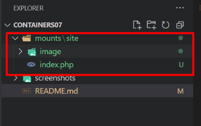
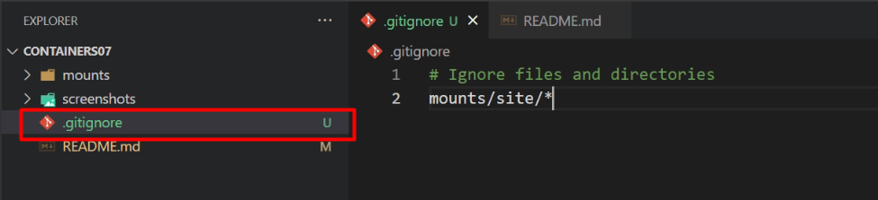
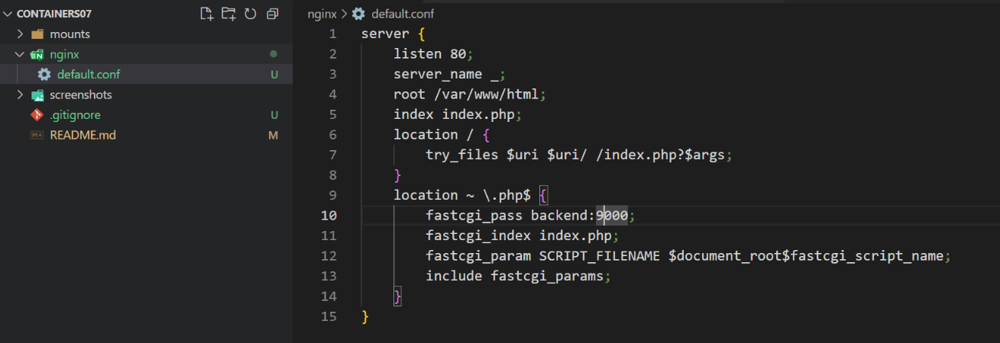
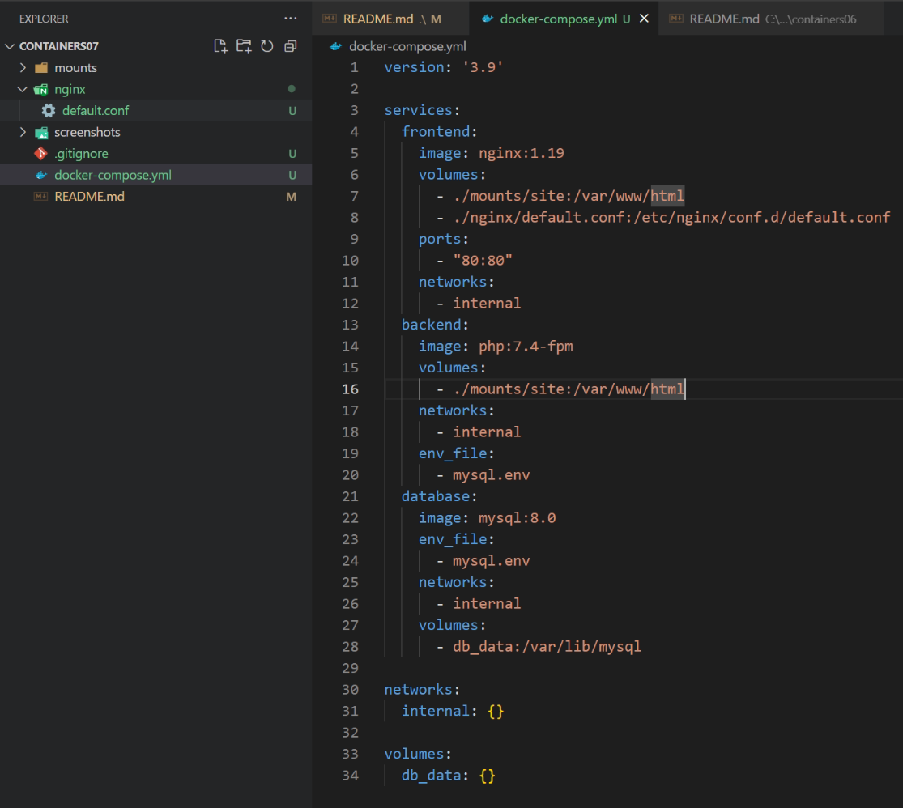
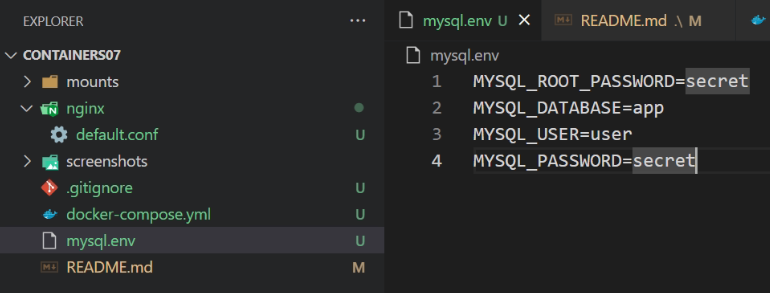

# Лабораторная работа №7. Создание многоконтейнерного приложения
## Студент
**Gachayev Dmitrii I2302**  
**Выполнено 11.04.2025**  

## Цель работы
Ознакомиться с работой многоконтейнерного приложения на базе docker-compose.
## Задание
Создать php приложение на базе трех контейнеров: nginx, php-fpm, mariadb, используя docker-compose.
# Выполнение
1. Создаю директорию `mounts/site` и переношу туда сайт с предмета php. 



2. Создаю `.gitignore` и вношу туда 

```bash
# Ignore files and directories
mounts/site/*
```



3. Создаю в директории `containers07` файл `nginx/default.conf` со следующим содержимым:

```bash
server {
    listen 80;
    server_name _;
    root /var/www/html;
    index index.php;
    location / {
        try_files $uri $uri/ /index.php?$args;
    }
    location ~ \.php$ {
        fastcgi_pass backend:9000;
        fastcgi_index index.php;
        fastcgi_param SCRIPT_FILENAME $document_root$fastcgi_script_name;
        include fastcgi_params;
    }
}
```



4. Создайте в директории `containers07` файл `docker-compose.yml` со следующим содержимым:

```bash
version: '3.9'

services:
  frontend:
    image: nginx:1.19
    volumes:
      - ./mounts/site:/var/www/html
      - ./nginx/default.conf:/etc/nginx/conf.d/default.conf
    ports:
      - "80:80"
    networks:
      - internal
  backend:
    image: php:7.4-fpm
    volumes:
      - ./mounts/site:/var/www/html
    networks:
      - internal
    env_file:
      - mysql.env
  database:
    image: mysql:8.0
    env_file:
      - mysql.env
    networks:
      - internal
    volumes:
      - db_data:/var/lib/mysql

networks:
  internal: {}

volumes:
  db_data: {}

```



5. Создаю файл `mysql.env` в корне проекта и добавляю в него строки:
```sql
MYSQL_ROOT_PASSWORD=secret
MYSQL_DATABASE=app
MYSQL_USER=user
MYSQL_PASSWORD=secret
```




