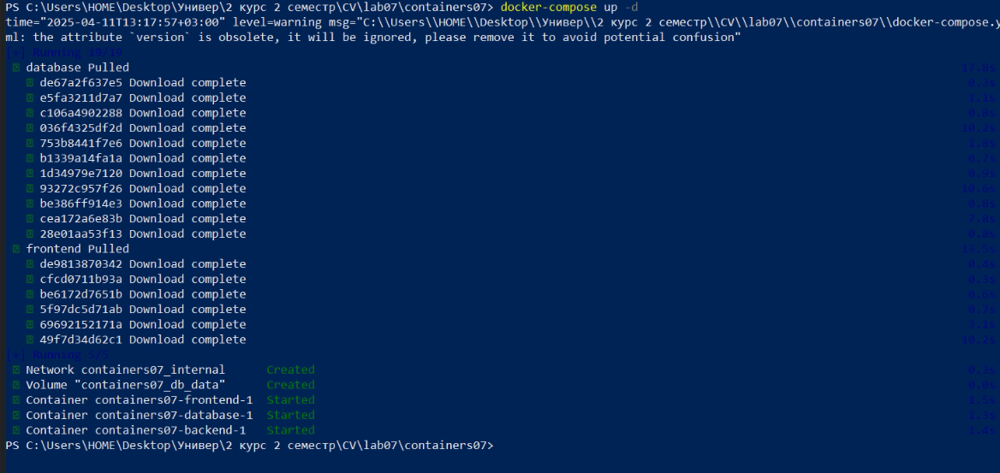

# Лабораторная работа №7. Создание многоконтейнерного приложения
## Студент
**Gachayev Dmitrii I2302**  
**Выполнено 11.04.2025**  

## Цель работы
Ознакомиться с работой многоконтейнерного приложения на базе docker-compose.
## Задание
Создать php приложение на базе трех контейнеров: nginx, php-fpm, mariadb, используя docker-compose.
# Выполнение
1. Создаю директорию `mounts/site` и переношу туда сайт с предмета php. 


2. Создаю `.gitignore` и вношу туда 

```bash
# Ignore files and directories
mounts/site/*
```


3. Создаю в директории `containers07` файл `nginx/default.conf` со следующим содержимым:

```bash
server {
    listen 80;
    server_name _;
    root /var/www/html;
    index index.php;
    location / {
        try_files $uri $uri/ /index.php?$args;
    }
    location ~ \.php$ {
        fastcgi_pass backend:9000;
        fastcgi_index index.php;
        fastcgi_param SCRIPT_FILENAME $document_root$fastcgi_script_name;
        include fastcgi_params;
    }
}
```


4. Создайте в директории `containers07` файл `docker-compose.yml` со следующим содержимым:

```bash
version: '3.9'

services:
  frontend:
    image: nginx:1.19
    volumes:
      - ./mounts/site:/var/www/html
      - ./nginx/default.conf:/etc/nginx/conf.d/default.conf
    ports:
      - "80:80"
    networks:
      - internal
  backend:
    image: php:7.4-fpm
    volumes:
      - ./mounts/site:/var/www/html
    networks:
      - internal
    env_file:
      - mysql.env
  database:
    image: mysql:8.0
    env_file:
      - mysql.env
    networks:
      - internal
    volumes:
      - db_data:/var/lib/mysql

networks:
  internal: {}

volumes:
  db_data: {}

```


Этот файл описывает многоконтейнерное приложение, которое запускается с помощью `Docker Compose`. В нём определены три сервиса: `веб-сервер (frontend)` на базе nginx, `сервер обработки PHP-скриптов (backend)` на базе php-fpm, и `база данных MySQL (database)`. Фронтенд-контейнер обслуживает сайт, подключает конфигурацию nginx и открывает порт 80 для доступа из браузера. Бэкенд-контейнер обрабатывает PHP-файлы и использует общую директорию сайта с фронтендом. Контейнер базы данных запускает MySQL, используя переменные из файла mysql.env и сохраняет данные в отдельный Docker-том, чтобы они не терялись при перезапуске. Все они подключены к одной внутренней сети `internal`, чтобы могли взаимодействовать друг с другом.

5. Создаю файл `mysql.env` в корне проекта и добавляю в него строки:
```sql
MYSQL_ROOT_PASSWORD=secret
MYSQL_DATABASE=app
MYSQL_USER=user
MYSQL_PASSWORD=secret
```


# Запуск и тестирование

1. Запускаю контейнеры командой:

```bash
docker-compose up -d
```



2. Проверяю работу сайта в браузере по адресу `http://localhost`. Все работает корректно.


# Контрольные вопросы
1. В каком порядке запускаются контейнеры?

Контейнеры запускаются одновременно, так как в `docker-compose.yml` не указаны зависимости (depends_on). 

2. Где хранятся данные базы данных?

Данные `MySQL` хранятся в томе `Docker` с именем `db_data`, который монтируется в путь `/var/lib/mysql` внутри контейнера базы данных. Этот том определяется в секции `volumes:`.


3. Как называются контейнеры проекта?

По умолчанию `Docker Compose` формирует имена контейнеров в формате:

`<названиепапки>_<имясервиса>_1`

В моем случае:
- `containers07_frontend_1`
- `containers07_backend_1`
- `containers07_database_1`

4. Вам необходимо добавить еще один файл `app.env` с переменной окружения `APP_VERSION` для сервисов `backend` и `frontend`. Как это сделать?

Необходимо создать файл `app.env` в корне проекта и добавить строку:

```bash
APP_VERSION=...
```

Далее в `docker-compose.yml` добавить ссылку на этот файл в оба сервиса — `frontend` и `backend`.

```bash
 env_file:
      - mysql.env
      - app.env
```

# Вывод
В ходе выполнения лабораторной работы была успешно реализована многоконтейнерная архитектура веб-приложения с использованием `docker-compose`. Приложение состоит из трёх взаимосвязанных контейнеров: `веб-сервер (nginx)`, сервер обработки `PHP (php-fpm)` и база данных `(mysql)`. Все компоненты были настроены и объединены, обеспечивая корректное взаимодействие между собой.